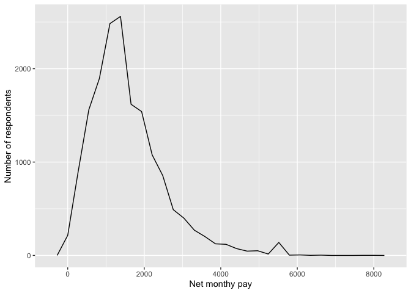
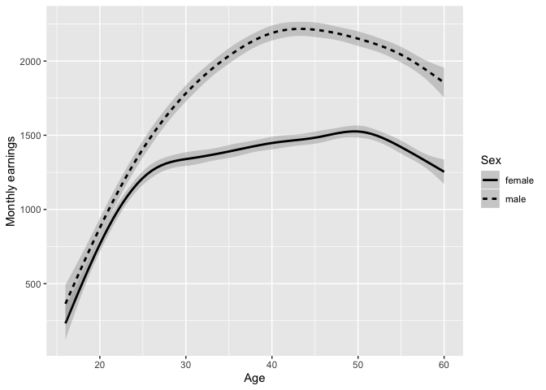
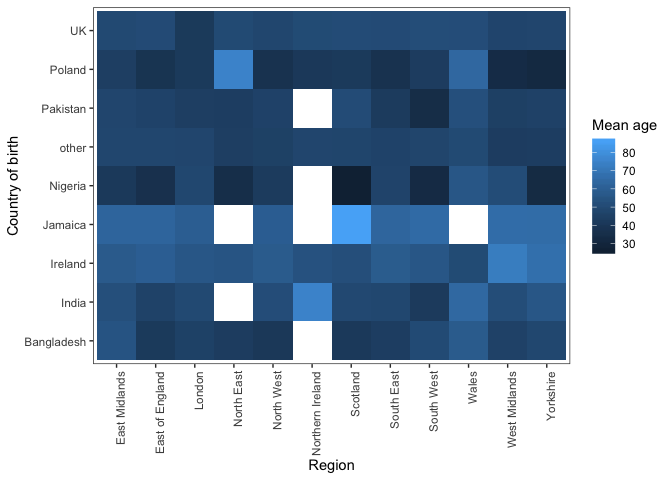
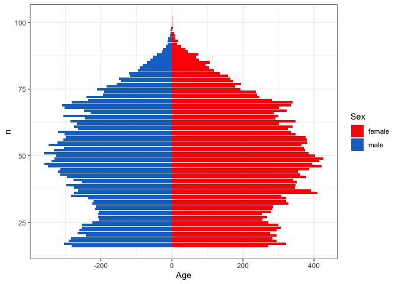

Statistical assignment 4
================
Emilia Korobowicz
01/03/2019

In this assignment you will need to reproduce 5 ggplot graphs. I supply
graphs as images; you need to write the ggplot2 code to reproduce them
and knit and submit a Markdown document with the reproduced graphs (as
well as your .Rmd file).

First we will need to open and recode the data. I supply the code for
this; you only need to change the file paths.

    ```r
    library(tidyverse)
    Data8 <- read_tsv("/Users/emiliakorobowicz/Desktop/DataScience3/EmilysRepo/NewRepo/Data/UKDA-6614-tab/tab/ukhls_w8/h_indresp.tab")
    Data8 <- Data8 %>%
        select(pidp, h_age_dv, h_payn_dv, h_gor_dv)
    Stable <- read_tsv("/Users/emiliakorobowicz/Desktop/DataScience3/EmilysRepo/NewRepo/Data/UKDA-6614-tab/tab/ukhls_wx/xwavedat.tab")
    Stable <- Stable %>%
        select(pidp, sex_dv, ukborn, plbornc)
    Data <- Data8 %>% left_join(Stable, "pidp")
    rm(Data8, Stable)
    Data <- Data %>%
        mutate(sex_dv = ifelse(sex_dv == 1, "male",
                           ifelse(sex_dv == 2, "female", NA))) %>%
        mutate(h_payn_dv = ifelse(h_payn_dv < 0, NA, h_payn_dv)) %>%
        mutate(h_gor_dv = recode(h_gor_dv,
                         `-9` = NA_character_,
                         `1` = "North East",
                         `2` = "North West",
                         `3` = "Yorkshire",
                         `4` = "East Midlands",
                         `5` = "West Midlands",
                         `6` = "East of England",
                         `7` = "London",
                         `8` = "South East",
                         `9` = "South West",
                         `10` = "Wales",
                         `11` = "Scotland",
                         `12` = "Northern Ireland")) %>%
        mutate(placeBorn = case_when(
                ukborn  == -9 ~ NA_character_,
                ukborn < 5 ~ "UK",
                plbornc == 5 ~ "Ireland",
                plbornc == 18 ~ "India",
                plbornc == 19 ~ "Pakistan",
                plbornc == 20 ~ "Bangladesh",
                plbornc == 10 ~ "Poland",
                plbornc == 27 ~ "Jamaica",
                plbornc == 24 ~ "Nigeria",
                TRUE ~ "other")
        )
    ```

Reproduce the following graphs as close as you can. For each graph,
write two sentences (not more\!) describing its main message.

1.  Univariate distribution (20
    points).
    
    ``` r
    ggplot(Data, aes(x = h_payn_dv)) + geom_freqpoly() + xlab("Net monthy pay") + 
      ylab("Number of respondents")
    ```
    
    <!-- -->

This frequency polynomial represents the distribution of net monthly pay
amongst the respondents. Most people earn around 1400 GBP a month (the
exact median is 1390, to be precise).

2.  Line chart (20 points). The lines show the non-parametric
    association between age and monthly earnings for men and
    women.
    
    ``` r
    ggplot(Data, aes(x = h_age_dv, y = h_payn_dv, group = sex_dv, linetype = sex_dv)) + geom_smooth(color = "black") +
      xlab ("Age") + ylab ("Monthly earnings") + 
      scale_x_continuous(limits = c(16, 60), breaks = seq(20, 60, 10)) + 
      scale_linetype_discrete(name  ="Sex")
    ```
    
    <!-- -->

Men earn more than females regardless of age, however, the pay-gap only
starts to widen significantly in the respondents’ the mid-20s. The peak
remuneration for the respondents occurs in their 40s (early 40s for men
and late for women), after which the pay declines with age.

3.  Faceted bar chart (20
    points).
    
    ``` r
    df_plot3 <- Data  %>% group_by(sex_dv, placeBorn)  %>% summarise(median = median(na.omit(h_payn_dv)))
    df_plot3 <- na.omit(df_plot3)
    ggplot(data = df_plot3, aes(x = sex_dv, y = median)) + 
    geom_bar(stat = "identity") + facet_wrap(. ~ placeBorn, ncol = 3) +
    xlab("Sex") + ylab("Median monthly net pay")
    ```
    
    <!-- -->

The 9 graphs show the relationship between the respondents’ origin
(derived from birthplace), sex and median monthly net pay. Regardless of
origin women earn less than men across all groups and the pay-gap is
widest amongst the Irish.

4.  Heat map (20
    points).
    
    ``` r
    df_plot4 <- Data  %>% group_by(h_gor_dv, placeBorn)  %>% summarise(mean = mean(h_age_dv))
    ggplot(na.omit(df_plot4), aes(h_gor_dv, placeBorn, fill= mean)) + 
      geom_tile() + scale_fill_continuous(name = "Mean age") + 
      xlab("Region") + ylab ("Country of birth") + 
      theme_bw() + theme(panel.grid.major = element_blank(), panel.grid.minor = element_blank(), 
                     axis.text.x = element_text(angle = 90, hjust = 1))
    ```
    
    <!-- -->

The heat map shows the relation between the respondents’ country of
birth, the region of residence and the mean age of the members of each
identity group across the regions. The map suggests that the following
key points: looking at regions, London and South East exhibit a
homogeneous pattern of low mean age across different countries of birth
and that people born in the top of the heatmap (from the UK to Nigeria)
tend to be younger in average, across different regions (especially
Nigeria).

5.  Population pyramid (20
    points).
    
    ``` r
    df_plot5 <- Data  %>% group_by(h_age_dv, sex_dv)  %>% summarise(pop = length(h_age_dv))
    df_plot5 <- na.omit(df_plot5)
    df_plot5$pop <- ifelse(df_plot5$sex_dv == "male", -1*df_plot5$pop, df_plot5$pop)
    ggplot(df_plot5, aes(x = h_age_dv, y = pop, fill = sex_dv, group = sex_dv)) + 
      geom_bar(data = subset(df_plot5, sex_dv == "female"), stat = "identity") +
      geom_bar(data = subset(df_plot5, sex_dv == "male"), stat = "identity") +
      coord_flip() + scale_fill_manual(name = "Sex", values = c("red", "dodgerblue3")) + 
      ylab("Age") + xlab("n") + theme_bw()
    ```
    
    <!-- -->

The UKHLS derived population pyramid has quite a narrow base but a large
middle, thus the population of is ageing. Additionally, above the age of
25 there are siginificantly more females than males which suggests there
are either more female immigrants, more male emigrants or that men die
younger.
